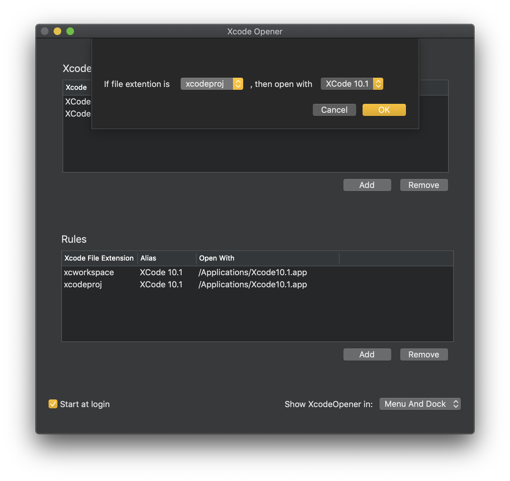

# XcodeOpener

  

Select which file will be opened by which xcode.



if you want recover registeration, click the back to xcode button on the menu.


## Under the hood

1. Register self as the default application that the files with specific extension will be opened with.
2. When self receive openURL notification, we decide which real application user specified before to open it.
3. Done


## Core

``` Swift
/*
Sets the user’s preferred default handler for the specified content type in the specified roles.
*/
LSSetDefaultRoleHandlerForContentType(_:_:_:)

/*
Returns the application bundle identifier of the user’s preferred default handler for the specified content type with the specified role.
*/
LSCopyDefaultRoleHandlerForContentType(_:_:)
```
